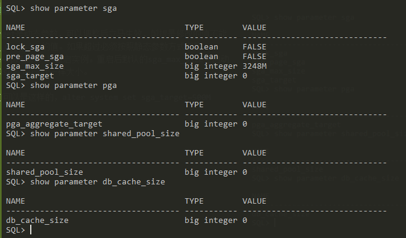

##### 查看



<!--more-->

sga_target是动态参数，可以调整后立马生效，前提是修改的值不能超过sga_max_size的值。如果超过必须按照静态参数方式调整（[scope=spfile?](#sp)）并重启实例。重启后默认的sga_max_size会自动调整到和sga_target一样大小。

修改语句可以是这样的，alter system set sga_target=500M

pga同理，但发现共享池和数据缓存区大小都为0。因为Oracle设置为SGA自动管理。共享池和数据缓存区的大小由sga_max_size和sga_target_size决定。

一般情况下都建议使用SGA内存大小自动分配的策略，如果要手动改，把sga_target_size设为0，再把shared_pool_size和db_cache_size设置为非0。


log_buffer的大小由于日志每满1M写一次，每满1/3写一次，所以太大也没什么卵用，系统默认是15M。

##### 修改

alter system 命令增加了一个scope选项，参数有三个：`memory`、`spfile`、`both`。

- memory：只改变当前实例运行，重新启动数据库后失效。
- spfile：只改变spfile的设置，不改变当前实例运行，重启数据库后生效。
- both：同时改变实例及spfile，当前更改立即生效，重启后仍然生效。

完整命令如下：
```sql
alter system set <parameter_name>=<value> scope=memory|spfile|both [sid=<sid_name>]
```

sid 用作RAC环境下指定不同实例。

<span id="sp"></span>
1. 如果当前实例使用的是pfile而非spfile，则scope=spfile或scope=both会出错；

2. 如果实例以pfile启动，则scope的默认值是memory，若以spfile启动，默认为both；

3. 有些参数必须重启才能生效，比如log_buffer；

4. scope不写默认是both。

log_buffer修改必须重启，所以scope=memory和both都报错。

 

最后查看依旧没有变化，需要重启后才生效。
